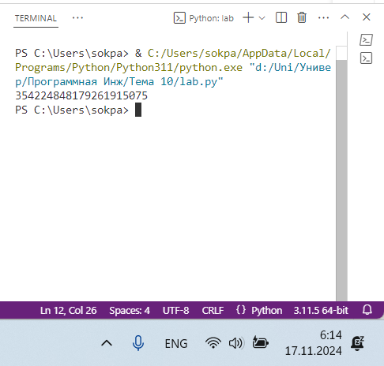
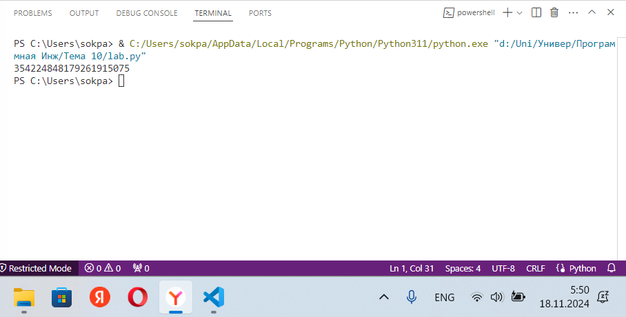
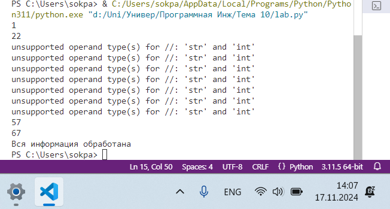
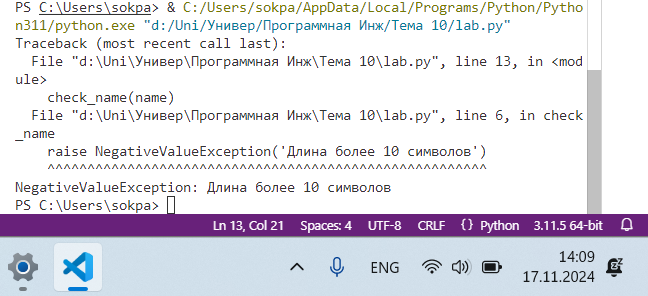
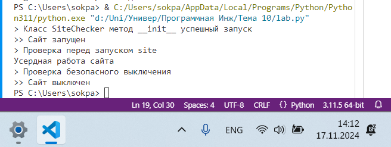
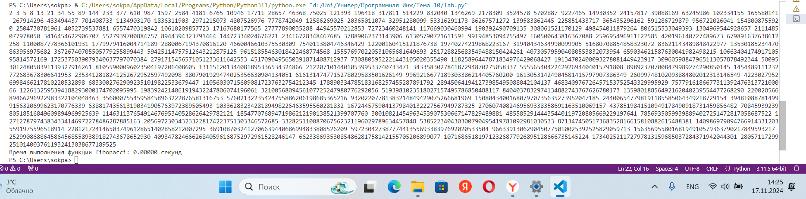
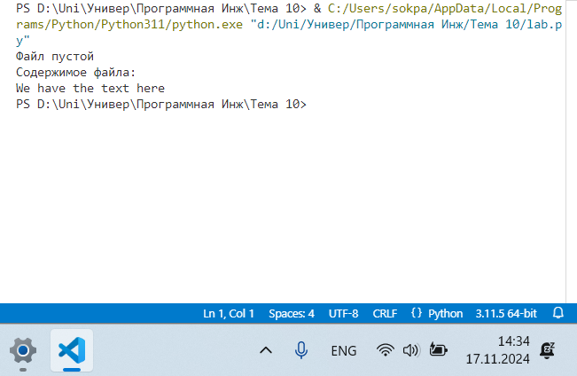
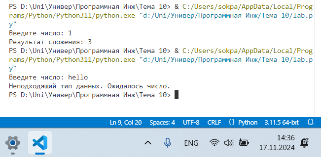
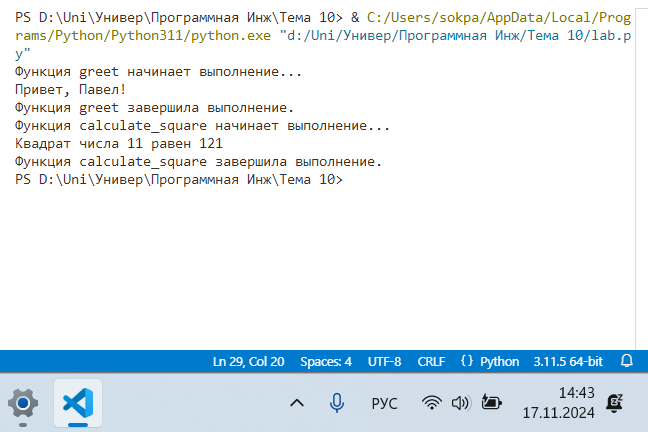
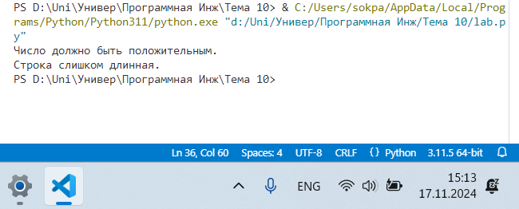

# Тема 10. Декораторы и исключения
Отчет по Теме #10 выполнил(а):
- Соколов Павел Дмитриевич
- ИВТ-22-1

| Задание | Лаб_раб | Сам_раб |
| ------ | ------ | ------ |
| Задание 1 | + | + |
| Задание 2 | + | + |
| Задание 3 | + | + |
| Задание 4 | + | + |
| Задание 5 | + | + |
| Задание 6 | - | - |
| Задание 7 | - | - |
| Задание 8 | - | - |
| Задание 9 | - | - |
| Задание 10 | - | - |

знак "+" - задание выполнено; знак "-" - задание не выполнено;

Работу проверили:
- к.э.н., доцент Панов М.А.

## Лабораторная работа №1
### Наверняка вы думаете, что декораторы - это какая-то бесполезная вещь, которая вам никогда не пригодится, но тут вдруг на паре по математике преподаватель просит всех посчитать число Фибоначчи для 100. Кто-то будет считать вручную (так точно не нужно), кто-то посчитает на калькуляторе, а кто-то подумает, что он самый крутой и напишет рекурсивную программу на Python и немного огорчится, потому что данная программа будет достаточно долго считаться, если ее просто так запускать. Но именно тут к вам на помощь приходят декораторы, например @lru_cache (он предназначен для решения задач динамическим программированием, если простыми словами, то этот декоратор запоминает промежуточные результаты и при рекурсивном вызове функции программа не будет считать одни и те же значения, а просто "возьмёт их из этого декоратора"). Вам нужно написать программу, которая будет считать числа Фибоначчи для 100 и запустить ее без этого декоратора и с ним, посмотреть на разницу во времени решения поставленной задачи.
### P.S. при запуске без декоратора можете долго не ждать, для наглядности хватит 10 секунд ожидания.

```python
from functools import lru_cache

@lru_cache(None) # декоратор динамического программирования 
def fibonacci(n): 
    if n == 0:
        return 0
    elif n == 1:
        return 1
    return fibonacci(n - 1) + fibonacci(n - 2)

if __name__ == '__main__':
    print(fibonacci(100))
```
### Результат.


## Выводы
- Программа вычисляет числа Фибоначчи с использованием рекурсии и декоратора @lru_cache, который кэширует результаты вычислений.
- Это значительно ускоряет выполнение программы, так как повторные вызовы с одинаковыми аргументами не требуют повторных вычислений.
- Выводит значение 100-го числа Фибоначчи.

## Лабораторная работа №2
### Илья пишет свой сайт и ему необходимо сделать минимальную проверку ввода данных пользователя при регистрации. Для этого он реализовал функцию, которая выводит данные пользователя на экран и решил, что будет проверять правильность введённых данных при помощи декоратора, но в этом ему потребовалась ваша помощь. Напишите декоратор для функции, который будет принимать все параметры вызываемой функции (имя, возраст) и проверять чтобы возраст был больше 0 и меньше 130.
### Причем заметьте, что неважно сколько пользователь введет данных на сайт к Илье, будут обрабатываться только первые 2 аргумента.
```python
def check(input_func):
    def output_func(*args):
        name, age = args[0], args[1]
        
        
        if age < 0 or age > 130:
            age = 'Недопустимый возраст'
        input_func(name, age)
    return output_func


@check
def personal_info(name, age):
    print(f"Name: {name} Age: {age}")

if __name__ == '__main__':
    personal_info("Владимир", 38) 
    personal_info('Александр', -5) 
    personal_info('Петр', 138, 15, 48, 2)
```
### Результат.


## Выводы
- Декоратор проверяет корректность возраста перед вызовом функции, которая выводит имя и возраст.
- Если возраст некорректен (отрицательное значение или больше 130), он заменяется на текст "Недопустимый возраст".
- Программа демонстрирует использование аргументов и защиту данных с помощью декоратора.

## Лабораторная работа №3
### Вам понравилась идея Ильи с сайтом, и вы решили дальше работать вместе с ним. Но вот в вашем проекте появилась проблема, кто-то пытается сломать вашу функцию с получением данных для сайта. Эта функция работает только с данными integer, а какой-то недохакер пытается все сломать и вместо нужного типа данных отправляет string.
### Воспользуйтесь исключениями, чтобы неподходящий тип данных не ломал ваш сайт.
### Также дополнительно можете обернуть весь код функции в try/except/finally для того, чтобы программа вас оповестила о том, что выявлена какая-то ошибка или программа успешно выполнена.
```python
def data(*args):
    try:
        for i in range(len(*args)):
            try:
                result = (args[0][i] * 15) // 10 
                print(result)
            except Exception as ex:
                print(ex)
    except Exception as ex:
        print(ex)
    finally:
        print('Вся информация обработана')

if __name__ == '__main__': 
    data([1, 15, 'Hello', 'i', 'try', 'to','crash','your','site',38,45])
```
### Результат.


## Выводы
- Программа принимает список данных и обрабатывает их в цикле, вычисляя для каждого элемента значение (элемент * 15) // 10.
- Если элемент невозможно обработать (например, строка), выбрасывается исключение, но программа продолжает выполнение для следующих элементов.
- Выводится сообщение об ошибке для некорректных данных, а в конце — общее сообщение "Вся информация обработана".
  
## Лабораторная работа №4
### Продолжая работу над сайтом, вы решили написать собственное исключение, которое будет вызываться в случае, если в функцию проверки имени при регистрации передана строка длиннее десяти символов, а если имя имеет допустимую длину, то в консоль выводиться "Успешная регистрация"
```python
class NegativeValueException(Exception): 
    pass

def check_name(name):
    if len(name) > 10:
        raise NegativeValueException('Длина более 10 символов') 
    else:
        print('Yспешная регистрация')


if __name__ == '__main__': 
    name = '12345678910' 
    check_name(name)
```
### Результат.


## Выводы
- Проверяется длина строки имени: если она превышает 10 символов, вызывается пользовательское исключение.
- Если длина строки допустима, выводится сообщение об успешной регистрации.
- Программа демонстрирует создание и использование пользовательских исключений.

## Лабораторная работа №5
### После запуска сайта вы поняли, что вам необходимо добавить логгер, для отслеживания его работы. Готовыми вариантами вы не захотели пользоваться, и поэтому решили создать очень простую пародию. Для этого создали две функции: ＿ init () (вызывается при создании класса декоратора в программе) и call () (вызывается при вызове декоратора). Создайте необходимый вам декоратор. Выведите все логи в консоль.
```python
class SiteChecker:
    def __init__(self, func): 
        print('> Класс SiteChecker метод __init__ успешный запуск') 
        self.func = func

    def __call__(self):
        print('> Проверка перед запуском', self.func.__name__)
        self.func()
        print('> Проверка безопасного выключения')


@SiteChecker
def site():
    print('Усердная работа сайта')

if __name__ == '__main__': 
    print('>> Сайт запущен')
    site()
    print('>> Сайт выключен')
```
### Результат.


## Выводы
- Декоратор-класс проверяет выполнение функции перед ее запуском и после завершения.
- В примере декорируется функция, симулирующая работу сайта, с выводом сообщений о проверках перед запуском и завершением.
- Позволяет убедиться, что основная функция выполняется в безопасной среде.

## Самостоятельная работа №1
### Вовочка решил заняться спортивным программированием на python, но для этого он должен знать за какое время выполняется его программа. Он решил, что для этого ему идеально подойдет декоратор для функции, который будет выяснять за какое время выполняется та или иная функция. Помогите Вовочке в его начинаниях и напишите такой декоратор.
### Подсказка: необходимо использовать модуль time 
### Декоратор необходимо использовать для этой функции:
.png)
### Результатом вашей работы будет листинг кода и скриншот консоли, в котором будет выполненная функция Фибоначчи и время выполнения программы.
### Также на этом примере можете посмотреть, что решение задач через рекурсию не всегда является хорошей идеей. Поскольку решение Фибоначчи для 100 с использованием рекурсии и без динамического программирования решается более десяти секунд, а решение точно такой же задачи, но через цикл for еще и для 200, занимает меньше 1 секунды.

```python
import time

# Декоратор для измерения времени выполнения функции
def timing_decorator(func):
    def wrapper(*args, **kwargs):
        start_time = time.time()
        result = func(*args, **kwargs)
        end_time = time.time()
        print(f"\nВремя выполнения функции {func.__name__}: {end_time - start_time:.5f} секунд")
        return result
    return wrapper

# Функция вычисления чисел Фибоначчи
@timing_decorator
def fibonacci():
    fib1 = fib2 = 1
    for _ in range(2, 200):
        fib1, fib2 = fib2, fib1 + fib2
        print(fib2, end=' ')

if __name__ == "__main__":
    fibonacci()
```
### Результат.


## Выводы
- Декоратор timing_decorator измеряет время выполнения функции.
- Функция вычисляет числа Фибоначчи до 200-го с использованием цикла и выводит их на экран.
- Время выполнения отображается в секундах.

## Самостоятельная работа №2
### Посмотрев на Вовочку, вы также загорелись идеей спортивного программирования, начав тренировки вы узнали, что для решения некоторых задач необходимо считывать данные из файлов. Но через некоторое время вы столкнулись с проблемой что файлы бывают пустыми, и вы не получаете вводные данные для решения задачи. После этого вы решили не просто считывать данные из файла, а всю конструкцию оборачивать в исключения, чтобы избежать такой
### проблемы. Создайте пустой файл и файл, в котором есть какая-то информация. Напишите код программы. Если файл пустой, то, нужно вызвать исключение ("бросить исключение") и вывести в консоль "файл пустой", а если он не пустой, то вывести информацию из файла.

```python
def read_file(file_name):
    try:
        with open(file_name, 'r') as file:
            content = file.read().strip()
            if not content:
                raise ValueError("Файл пустой")
            print("Содержимое файла:")
            print(content)
    except ValueError as e:
        print(e)

read_file("empty_file.txt")
read_file("non_empty_file.txt")

```
### Результат.


## Выводы
- Программа читает содержимое файла и проверяет, не является ли он пустым.
- Если файл пустой, выбрасывается исключение ValueError с соответствующим сообщением.
- Для непустого файла выводится его содержимое.

## Самостоятельная работа №3
### Напишите функцию, которая будет складывать 2 и введенное пользователем число, но если пользователь введет строку или другой неподходящий тип данных, то в консоль выведется ошибка "Неподходящий тип данных. Ожидалось число.". Реализовать функционал программы необходимо через try/except и подобрать правильный тип исключения. Создавать собственное исключение нельзя. Проведите несколько тестов, в которых исключение вызывается и нет. Результатом выполнения задачи будет листинг кода и получившийся вывод в консоль

```python
def add_two_to_number():
    try:
        user_input = input("Введите число: ")
        number = int(user_input)
        print(f"Результат сложения: {2 + number}")
    except ValueError:
        print("Неподходящий тип данных. Ожидалось число.")

add_two_to_number()
```
### Результат.


## Выводы
- Функция запрашивает ввод числа у пользователя, складывает его с 2 и выводит результат.
- Если введено некорректное значение (например, строка), выводится сообщение об ошибке "Неподходящий тип данных. Ожидалось число.".

## Самостоятельная работа №4
### Создайте собственный декоратор, который будет использоваться для двух любых вами придуманных функций. Декораторы, которые использовались ранее в работе нельзя воссоздавать. Результатом выполнения задачи будет: класс декоратора, две как-то связанными с ним функциями, скриншот консоли с выполненной программой и подробные комментарии, которые будут описывать работу вашего кода.

```python
# Создаем класс-декоратор
class CustomDecorator:
    def __init__(self, func):
        # Сохраняем ссылку на переданную функцию
        self.func = func

    def __call__(self, *args, **kwargs):
        # Этот метод срабатывает при вызове декорируемой функции
        print(f"Функция {self.func.__name__} начинает выполнение...")
        # Вызываем декорируемую функцию и сохраняем ее результат
        result = self.func(*args, **kwargs)
        print(f"Функция {self.func.__name__} завершила выполнение.")
        return result

# Декорируем функцию приветствия
@CustomDecorator
def greet(name):
    # Простая функция, которая приветствует пользователя
    print(f"Привет, {name}!")

# Декорируем функцию вычисления квадрата числа
@CustomDecorator
def calculate_square(number):
    # Функция вычисляет квадрат переданного числа
    print(f"Квадрат числа {number} равен {number ** 2}")

# Примеры использования
greet("Данил")          # Должно вывести сообщение о начале и конце выполнения
calculate_square(7)     # Должно вывести квадрат числа
```
### Результат.


## Выводы
- Класс-декоратор выводит сообщения перед вызовом и после выполнения декорируемой функции.
- В примере продемонстрированы две функции: приветствие пользователя и вычисление квадрата числа.

## Самостоятельная работа №5
### Создайте собственное исключение, которое будет использоваться в двух любых фрагментах кода. Исключения, которые использовались ранее в работе нельзя воссоздавать. Результатом выполнения задачи будет: класс исключения, код к котором в двух местах используется это исключение, скриншот консоли с выполненной программой и подробные комментарии, которые будут описывать работу вашего кода.

```python
# Создаем класс собственного исключения
class CustomException(Exception):
    # Класс наследует стандартный класс Exception
    pass

# Функция для проверки, является ли число положительным
def check_positive_number(number):
    """
    Проверяет, положительное ли число.
    Если число <= 0, вызывается CustomException.
    """
    if number <= 0:
        raise CustomException("Число должно быть положительным.")
    print(f"Число {number} подходит.")  # Если число положительное, выводим сообщение

# Функция для проверки длины строки
def check_string_length(string):
    """
    Проверяет, не превышает ли длина строки 10 символов.
    Если длина больше 10, вызывается CustomException.
    """
    if len(string) > 10:
        raise CustomException("Строка слишком длинная.")
    print(f"Строка '{string}' подходит.")  # Если строка подходит, выводим сообщение

# Пример 1: Проверка числа
try:
    check_positive_number(-5)  # Это вызовет исключение
except CustomException as e:
    print(e)  # Обрабатываем исключение и выводим сообщение

# Пример 2: Проверка длины строки
try:
    check_string_length("Очень длинная строка")  # Это вызовет исключение
except CustomException as e:
    print(e)  # Обрабатываем исключение и выводим сообщение
```
### Результат.


## Выводы
- Пользовательское исключение используется в двух функциях: для проверки положительного числа и длины строки.
- При нарушении условий вызывается исключение с поясняющим сообщением, которое перехватывается и выводится в консоль.

## Общие выводы по теме
Изучение декораторов и исключений позволило понять, как добавлять функционал к функциям и классам без их изменения и обрабатывать ошибки в коде. Декораторы оказались полезны для логирования, проверки данных и оптимизации работы программ. Исключения помогают обрабатывать ошибки без прерывания выполнения, что делает код более устойчивым. Реализация пользовательских исключений и декораторов показала их практическую применимость в сложных проектах. Полученные знания укрепляют базу для создания надежного и масштабируемого программного обеспечения.
