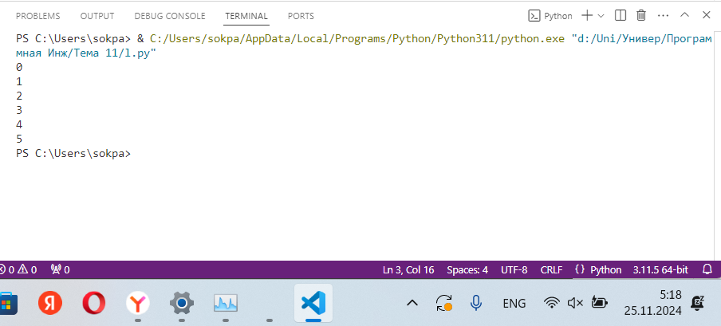
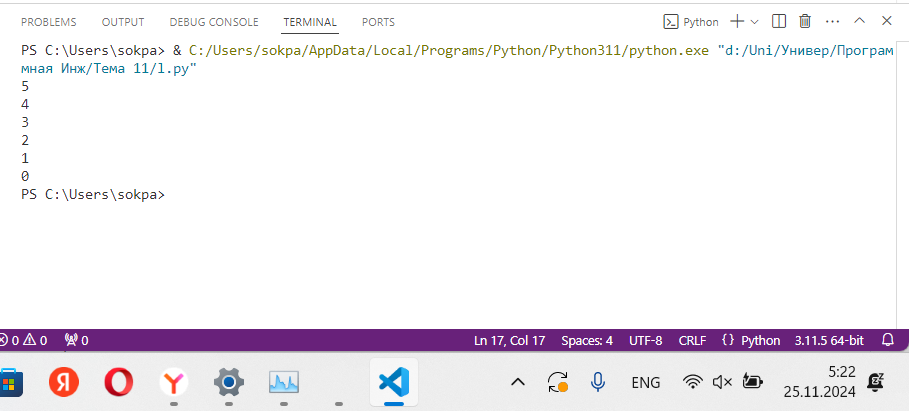
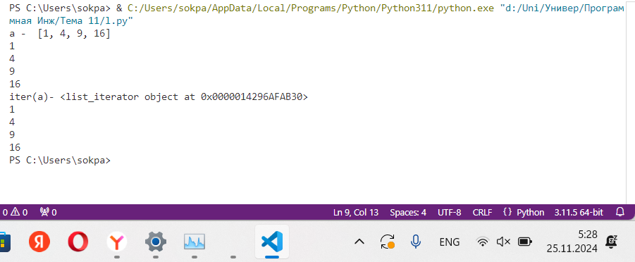
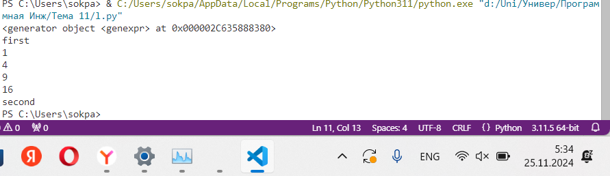
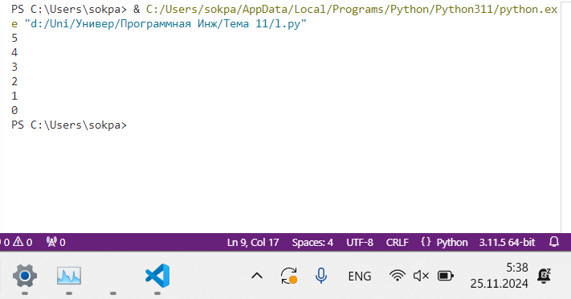

# Тема 11. Итераторы и генераторы
Отчет по Теме #11 выполнил(а):
- Соколов Павел Дмитриевич
- ИВТ-22-1

| Задание | Лаб_раб | Сам_раб |
| ------ | ------ | ------ |
| Задание 1 | + | + |
| Задание 2 | + | + |
| Задание 3 | + | - |
| Задание 4 | + | - |
| Задание 5 | + | - |
| Задание 6 | - | - |
| Задание 7 | - | - |
| Задание 8 | - | - |
| Задание 9 | - | - |
| Задание 10 | - | - |

знак "+" - задание выполнено; знак "-" - задание не выполнено;

Работу проверили:
- к.э.н., доцент Панов М.А.

## Лабораторная работа №1
### Простой итератор, но у него нет гибкой настройки, например его нельзя развернуть. Он работает просто как next(), но нет prev()

```python
numbers = [0, 1, 2, 3, 4, 5]
for item in numbers:
    print(item)
```
### Результат.


## Выводы
- Создается список numbers с элементами от 0 до 5.
- Цикл for проходит по каждому элементу списка и выводит его на экран.
- Итерация завершается, когда обработан последний элемент.

## Лабораторная работа №2
### Класс итератор с гибкой настройкой и удобными применением
```python
class CountDown:
    def __init__(self, start):
        self.count = start + 1

    def __iter__(self):
        return self
        
    def __next__(self):
        self.count -= 1
        if self.count < 0:
            raise StopIteration
        return self.count

if __name__ == '__main__':
    counter = CountDown(5)
    for i in counter:
        print(i)
```
### Результат.


## Выводы
- Определен класс CountDown, который представляет итератор для обратного отсчета.
- Метод __iter__ возвращает сам объект, чтобы его можно было использовать в цикле.
- Метод __next__ уменьшает счетчик self.count на единицу при каждом вызове и возвращает значение.
- Когда значение становится меньше 0, вызывается исключение StopIteration, чтобы завершить итерацию.
- В главной части программы создается объект CountDown с начальным значением 5, и числа от 5 до 0 выводятся в консоль.

## Лабораторная работа №3
### Генератор списка
```python
a = [i ** 2 for i in range(1, 5)]

print('a - ', a)
for i in a:
    print(i)

print('iter(a)-', iter(a))
for i in a: 
    print(i)
```
### Результат.


## Выводы
- Создается список a, содержащий квадраты чисел от 1 до 4 с помощью генератора списков.
- Выводится весь список a на экран.
- Проход по списку с помощью цикла for выводит каждый элемент.
- Использование iter(a) подтверждает, что список можно итерировать.
- Повторный цикл снова выводит элементы списка, так как списки сохраняют данные в памяти.
  
## Лабораторная работа №4
### Выражения генераторы
```python
b = (i ** 2 for i in range(1, 5))
print(b) # вывод не такой, как у генератора списков
print('first')
for i in b:
    print(i)
print('second')
# из-за особенностей выражений генераторов,
# они не будут выводиться больше одного раза

for i in b:
    print(i)
```
### Результат.


## Выводы
- Создается объект-генератор b, вычисляющий квадраты чисел от 1 до 4.
- При выводе b отображается, что это генератор (<generator object>), так как значения еще не вычислены.
- Первый цикл for выводит значения, которые вычисляются "на лету".
- После первого использования генератор истощается, и повторная итерация ничего не выводит.

## Лабораторная работа №5
### Такой же счетчик, как и в первом задании, только это генератор и использует yield
```python
def countdown(count):
    while count >= 0:
        yield count
        count -= 1

if __name__ == '__main__':
    counter = countdown(5)
    for i in counter:
        print(i)
```
### Результат.


## Выводы
- Определена функция-генератор countdown, которая выдает числа от count до 0.
- С каждой итерацией счетчик уменьшается, а функция yield возвращает текущее значение.
- В главной части программы создается генератор counter и выводятся значения от 5 до 0.

## Самостоятельная работа №1
### Вас никак не могут оставить числа Фибоначчи, очень уж они вас заинтересовали. Изучив новые возможности Python вы решили реализовать программу, которая считает числа Фибоначчи при помощи итераторов. Расчет начинается с чисел 1 и 1. Создайте функцию fib(n), генерирующую n чисел Фибоначчи с минимальными затратами ресурсов. Для реализации этой функции потребуется обратиться к инструкции yield (Она не сохраняет в оперативной памяти огромную последовательность, а дает возможность "доставать" промежуточные результаты по одному). Результатом решения задачи будет листинг кода и вывод в консоль с числом Фибоначчи от 200.

```python
def fib(n):
    a, b = 1, 1
    for _ in range(n):
        yield a
        a, b = b, a + b

# Генерация 200-го числа Фибоначчи
n = 200
fib_sequence = list(fib(n))
print(f"200-е число Фибоначчи: {fib_sequence[-1]}")
```
### Результат.


## Выводы
- Определена функция-генератор fib, которая выдает последовательность чисел Фибоначчи длиной n.
- Значения a и b обновляются в каждой итерации.
- Генератор преобразуется в список для получения 200-го числа Фибоначчи, которое выводится.

## Самостоятельная работа №2
### К коду предыдущей задачи добавьте запоминание каждого числа Фибоначчи в файл "fib.txt", при этом каждое число должно находиться на отдельной строчке. Результатом выполнения задачи будет листинг кода и скриншот получившегося файла

```python
def fib_to_file(n, filename):
    a, b = 1, 1
    with open(filename, "w") as file:
        for _ in range(n):
            file.write(f"{a}\n")
            a, b = b, a + b

# Генерация и запись 200 чисел Фибоначчи
filename = "fib.txt"
fib_to_file(200, filename)

print(f"Числа Фибоначчи записаны в файл {filename}.")
```
### Результат.


## Выводы
- Функция fib_to_file генерирует числа Фибоначчи и записывает их в файл fib.txt.
- Каждое число записывается на новой строке.
- Вызов функции с n=200 создает файл с 200 числами Фибоначчи.

## Общие выводы по теме
Итераторы и генераторы позволяют работать с последовательностями данных, экономя память и ресурсы. Итераторы требуют настройки методов для обработки данных, обеспечивая гибкость. Генераторы с использованием `yield` создают элементы "на лету". Выражения-генераторы удобны для одноразового применения, а списковые сохраняют данные в памяти. Эти инструменты упрощают обработку больших данных и сложных вычислений.
