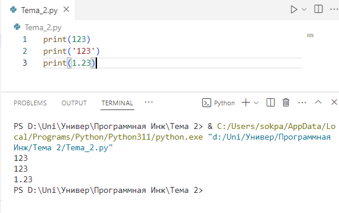

# Тема 2. Базовые операции языка Python.
Отчет по Теме #2 выполнил(а):
- Соколов Павел Дмитриевич
- ИВТ-22-1

| Задание | Лаб_раб | Сам_раб |
| ------ | ------ | ------ |
| Задание 1 | + | + |
| Задание 2 | + | + |
| Задание 3 | + | + |
| Задание 4 | + | + |
| Задание 5 | + | + |
| Задание 6 | + | - |
| Задание 7 | + | - |
| Задание 8 | + | - |
| Задание 9 | + | - |
| Задание 10 | + | - |

знак "+" - задание выполнено; знак "-" - задание не выполнено;

Работу проверили:
- к.э.н., доцент Панов М.А.

## Лабораторная работа №1
### Введите в консоль три строки. Первая - любое число. Вторая любое число в ввиде строки. Третье - любое число с плавающей точкой.
'''python
print(123)
print('123')
print(1.23)
'''
### Результат:

